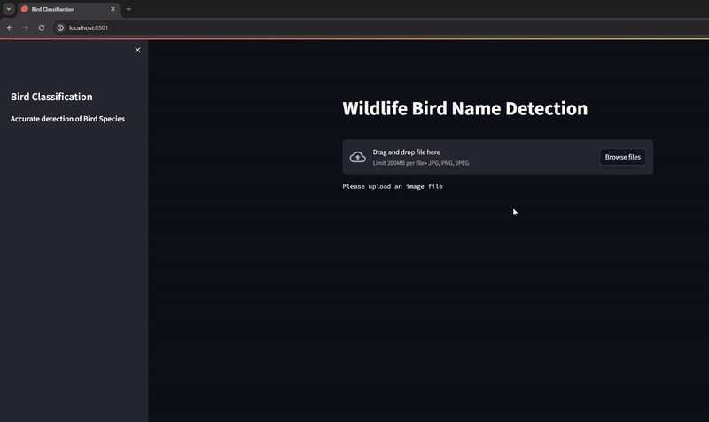

# Advance-AI
# Bird Detection

## Abstract
This project focuses on the development and evaluation of a deep learning model designed for bird species classification from images. Using a convolutional neural network (CNN), the model was trained on a dataset of 525 bird species. The dataset underwent extensive preprocessing, including data augmentation and cleaning, to enhance the model's performance. The training process showed significant improvements in accuracy and reductions in loss, indicating effective learning and generalization. The model's evaluation confirmed its high confidence in most predictions, although some areas still require improvement.

## Introduction
Bird species classification is a complex problem in both ornithology and computer vision due to the fine-grained visual differences and vast diversity of bird species. Advances in deep learning, particularly CNNs, have enabled significant accuracy in this task. This study presents a CNN trained on a meticulously compiled dataset featuring a wide array of bird species, with each species represented in high-quality images. Preprocessing included resizing, normalization, and data augmentation techniques to enhance model robustness and generalization.

## Dataset
The dataset consists of:
- 525 bird species
- 84,635 training images
- 2,625 test images (five per species)
- 2,625 validation images

The dataset includes only one bird per image, occupying at least half of the pixels. It has been cleaned to remove duplicates and low-quality images, preventing data leakage. Images are in 224x224 RGB format. The accompanying `birds.csv` file contains metadata for each image, including class ID, file paths, labels, dataset, and scientific names.

## Methods and Results

### Data Augmentation
The dataset was augmented with random flips, rotations, and zooms to increase variability and improve model generalization. Augmentation techniques included:
- Random Flip (horizontal)
- Random Rotation (±20%)
- Random Zoom (up to 40%)

### Model Architecture
The CNN model was built using TensorFlow and Keras, incorporating the following components:
- Input tensor: (224, 224, 3)
- Rescaling layer
- Multiple Conv2D layers with increasing filter sizes (32, 64, 128, 256)
- ReLU activation
- Batch normalization
- MaxPooling2D layers
- GlobalAveragePooling2D layer
- Dropout layer (rate: 0.5)
- Dense output layer (525 units, SoftMax activation)

### Training and Evaluation
The model was trained with a total of 1,115,353 parameters, 1,114,387 of which were trainable. Training and validation accuracy and loss were tracked over epochs. The model showed good convergence, with both training and validation metrics improving over time and eventually plateauing, indicating effective learning and generalization.

### Model Predictions

#### Antbird Prediction

- **Prediction:** ANTBIRD
- **Confidence:** 0.9999995231628418

### Key Findings
- The model achieved high accuracy on both training and validation sets, indicating robust performance.
- The small gap between training and validation metrics suggested minimal overfitting.
- The plateau in accuracy and loss plots indicated the model might benefit from further tuning, additional data, or more complex architectures.

### Significance
- The model's ability to generalize well to new data underscores its potential for practical applications in biodiversity monitoring and ecological research.
- Continuous model refinement is necessary to improve accuracy, especially for predictions with lower confidence.

### Conclusion
- The CNN model demonstrated strong performance in bird species classification, with high accuracy and confidence in many predictions.
- Further improvements could enhance the model's performance, particularly in less confident predictions.
- Evaluating the model on a diverse test set is crucial for confirming robustness and accuracy.

### Video Demonstration
Watch the demo of the bird detection system in action using Streamlit:

## References
1. [Kaggle Notebook](https://www.kaggle.com/code/denismachine/525-species-classification-tensorflow/notebook)
2. [DataCamp Data Augmentation Tutorial](https://www.datacamp.com/tutorial/complete-guide-data-augmentation)
3. [Towards Data Science CNN Explanation](https://towardsdatascience.com/convolutional-neural-networks-explained-9cc5188c4939)

